# Impetus-LLM-Server — Software Architecture Blueprint

## Executive Summary

Impetus-LLM-Server is a local LLM inference server optimized for Apple Silicon, providing an OpenAI-compatible API powered by MLX. This blueprint defines a comprehensive modernization strategy that transforms the current Flask-based architecture into a production-grade, async-native platform with retrieval-augmented generation (RAG), hybrid neural compute, and a modern React dashboard.

The recommended technology stack centers on **FastAPI 0.134.0** for the backend API layer, replacing Flask to unlock native async streaming, WebSocket support, and automatic OpenAPI documentation. For retrieval-augmented generation, **ChromaDB v1.5** serves as the MVP vector database paired with **nomic-embed-text-v1.5** embeddings running on-device via MLX, with a clear upgrade path to **Qdrant** for production scaling. The compute architecture adopts a **hybrid MLX GPU + Core ML ANE** strategy, routing LLM inference to the Metal GPU while offloading embedding computation to the Apple Neural Engine for 10-30x latency improvement. The frontend modernizes around **Zustand v5**, **TanStack Query v5**, **TanStack Router**, and **Tailwind CSS v4**, delivering type-safe state management, intelligent data caching, and zero-runtime styling.

Key architectural decisions include a disaggregated inference model separating prefill and decode phases across compute units, a phased RAG evolution from naive to agentic patterns, and an OpenTelemetry-based observability stack. The implementation roadmap spans approximately 24 weeks for a solo developer, organized into six phases with concrete deliverables per milestone.

## Table of Contents

<!-- Auto-generated by builder -->

## Project Overview and Requirements

### Functional Requirements

The modernization addresses gaps in the current implementation while preserving OpenAI API compatibility as the primary contract.

| ID | Description | Priority |
|----|-------------|----------|
| FR-01 | Async-native API layer with streaming SSE and WebSocket support | Must |
| FR-02 | OpenAI-compatible /v1/chat/completions with concurrent request handling | Must |
| FR-03 | Vector database integration for document storage and retrieval | Must |
| FR-04 | On-device embedding generation via MLX-compatible models | Must |
| FR-05 | RAG pipeline with query augmentation and context injection | Must |
| FR-06 | /v1/embeddings endpoint for embedding generation | Must |
| FR-07 | Hybrid compute dispatcher routing workloads across GPU and ANE | Should |
| FR-08 | Type-safe frontend with centralized state management | Should |
| FR-09 | Client-side routing with code splitting and lazy loading | Should |
| FR-10 | Real-time metrics dashboard with 3D hardware visualization | Should |
| FR-11 | API key management for local multi-user access control | Could |
| FR-12 | Agentic RAG with multi-hop retrieval and reflection | Could |
| FR-13 | Core ML ANE integration for embedding inference | Could |
| FR-14 | Model benchmarking with automated performance regression tests | Could |
| FR-15 | iOS client app leveraging Foundation Models framework | Won't |

### Non-Functional Requirements

All targets measured under standard operating conditions on Apple Silicon M1 8GB or later.

| Requirement | Target | Measurement |
|-------------|--------|-------------|
| API Response Latency (p95) | Less than 200ms for non-inference endpoints | Prometheus histogram |
| Streaming TTFT | Less than 500ms for 7B model, 100-token prompt | MLX benchmark suite |
| Embedding Latency | Less than 100ms per document via nomic-embed | Core ML profiler |
| Vector Search Latency | Less than 50ms for top-5 retrieval over 1M vectors | ChromaDB metrics |
| Concurrent Connections | 50 simultaneous WebSocket connections | Load test with locust |
| Memory Footprint | Less than 6GB total with model loaded on M1 8GB | Activity Monitor |
| API Uptime | 99.9% for local server during active sessions | Health endpoint monitoring |
| Test Coverage | 80% backend, 70% frontend | pytest-cov, vitest coverage |
| Build Time | Less than 60 seconds for frontend production build | Vite build timer |
| CI Pipeline Duration | Less than 5 minutes for full test suite | GitHub Actions metrics |
| Security | Zero critical OWASP Top 10 vulnerabilities | Trivy scan |
| Startup Time | Less than 10 seconds to healthy state without model | Health endpoint timer |

## Technology Stack Recommendations

The following section evaluates candidates across six technology domains, recommending specific versions with quantitative justification.

### Backend Framework

The backend framework must support async request handling, streaming SSE for token-by-token LLM output, WebSocket for real-time metrics, and automatic OpenAPI documentation for the OpenAI-compatible API surface.

| Criterion | FastAPI | Litestar | Quart | Starlette |
|-----------|---------|----------|-------|-----------|
| Latest Version | 0.134.0 | 2.21.0 | 0.20.0 | 0.52.1 |
| Release Date | Feb 27, 2026 | Feb 14, 2026 | Dec 23, 2024 | Recent 2026 |
| GitHub Stars | 95,700 | 8,000 | 29 | 12,000 |
| Monthly Downloads | 246M+ | 5M | 500K | 230M+ |
| License | MIT | MIT | MIT | BSD-3-Clause |
| Python 3.13 | Full support | Full support | Untested | Full support |
| Streaming SSE | Excellent | Excellent | Good | Foundation only |
| WebSocket | Native | Native + Channels | Excellent | Foundation only |
| Job Openings | 900+ | 50-100 | 10-20 | 200-300 |
| Migration from Flask | 2-4 weeks | 2-4 weeks | 2-5 days | 3-6 weeks |

**Recommendation: FastAPI 0.134.0**

FastAPI provides the optimal balance of ecosystem maturity (246M monthly downloads [32]), streaming excellence for LLM serving, and hiring market depth (900+ open positions, $128K-$193K salary range) [1]. Its Pydantic V2 integration aligns with the existing schema validation in Impetus-LLM-Server, and the automatic OpenAPI documentation eliminates manual API spec maintenance. While Litestar 2.21.0 offers 5-15% faster serialization via msgspec [2] [30], FastAPI's 12x larger community and proven LLM serving patterns (vLLM, text-generation-webui) reduce integration risk. Quart provides the lowest-friction migration path from Flask (2-5 days via drop-in async conversion [31]), but lacks FastAPI's automatic OpenAPI generation and community scale. Starlette serves as FastAPI's ASGI foundation [33] but requires manual schema validation and documentation. The migration from Flask 3.0 requires a full rewrite of route handlers and middleware (2-4 weeks), but yields native async/await support that eliminates the synchronous bottleneck in the current architecture [3].

### Inference Engine

MLX remains the primary inference engine with selective Core ML integration for embedding workloads.

| Criterion | MLX (GPU) | Core ML (ANE) | Core ML (GPU) |
|-----------|-----------|---------------|---------------|
| Latest Version | 0.30.6 | macOS 15 SDK | macOS 15 SDK |
| Decode Throughput | 230-250 tok/s (M4 Max) | 20-40 tok/s | 150-170 tok/s |
| Embedding Latency | 100ms (nomic-embed) | 3-5ms (DistilBERT) | 20ms |
| Memory Efficiency | Unified memory native | 6.6x less than PyTorch | Standard |
| Model Format | MLX weights | .mlpackage | .mlpackage |
| ANE Support | No (marked wontfix) | Native | N/A |
| Quantization | INT4, INT8 | INT4, INT8, palettize | INT4, INT8 |

**Recommendation: Hybrid MLX 0.30.6 + Core ML**

MLX 0.30.6 delivers the highest sustained decoding throughput at 230-250 tokens per second on M4 Max [4] [45], making it the clear choice for LLM inference. On-device benchmarks confirm MLX outperforms PyTorch and Core ML GPU paths for autoregressive decoding [34]. However, MLX explicitly does not support ANE (marked "wontfix" in issue 18 [25]), while Core ML on ANE achieves 3-5ms embedding latency compared to 100ms on MLX GPU [5], a 20-30x improvement that justifies a hybrid architecture. Apple's research on deploying transformers to ANE demonstrates that models under 500MB with standard attention patterns convert reliably via coremltools v9.0 [23] [36], with INT4 and palettization quantization options further reducing footprint [46]. The M5 GPU introduces neural accelerators that provide 4x speedup for matrix multiply operations transparently through MLX, reaching 153.6 GB/s memory bandwidth on M5 Max [6] [22] [48]. The recommended strategy routes LLM decode to MLX GPU and embedding generation to Core ML ANE, leveraging unified memory to eliminate data movement costs between compute units. Apple Intelligence APIs [37] and the reverse-engineered ANE architecture documentation [24] provide additional reference points for future on-device model optimization.

### Vector Database

| Criterion | ChromaDB | Qdrant | LanceDB | SQLite-vec | Milvus Lite |
|-----------|----------|--------|---------|------------|-------------|
| Latest Version | 1.5.1 | 1.17.0+ | 0.27-beta | Early 2025 | 2.5.x |
| GitHub Stars | 25,089 | 29,100 | 9,100 | 3,000+ | 32,000+ |
| License | Apache 2.0 | Apache 2.0 | Apache 2.0 | Open Source | Apache 2.0 |
| Query Latency (p50) | 10-50ms | 4ms | Less than 100ms | 50-200ms | 6ms |
| Max Vectors | 50M | Billions | 700M+ | 10M | 1M (Lite) |
| Memory Footprint | Low (SQLite) | Configurable | Minimal (Arrow) | Ultra-minimal | Low-medium |
| Apple Silicon | Native arm64 | MPS via Vulkan | MPS via Metal | Native | arm64 |
| GPU Acceleration | No | Yes | Yes | No | No |
| Ease of Use | 5 out of 5 | 3 out of 5 | 4 out of 5 | 4 out of 5 | 3 out of 5 |

**Recommendation: ChromaDB v1.5+ (MVP) with Qdrant upgrade path**

ChromaDB offers the fastest developer onboarding (three lines of code to start) with its 2025 Rust rewrite delivering 4x performance improvement [7]. The embedded architecture with SQLite persistence requires zero infrastructure overhead, fitting the local-first philosophy of Impetus-LLM-Server. At 1M vectors with 768-dimensional embeddings, ChromaDB consumes approximately 3GB on M1 8GB, leaving 1.8GB headroom for concurrent model inference [8]. LanceDB demonstrates viability at 700M+ vectors in production with its Arrow-native columnar format [35], but its beta status makes it premature for a primary recommendation. For production scaling beyond 50M vectors, Qdrant (29.1k GitHub stars [47]) provides 4ms p50 latency with horizontal sharding and GPU acceleration via Metal Performance Shaders [9].

### Embedding Pipeline

| Criterion | nomic-embed-text-v1.5 | e5-mistral-7b (4-bit) | all-MiniLM-L6-v2 |
|-----------|----------------------|----------------------|-------------------|
| Parameters | 137M | 7B (quantized) | 22M |
| Dimensions | 768 (variable 64-768) | 4,096 | 384 |
| MTEB Score | 62.39 (short) / 85.53 (long) | 69.5+ | 44 |
| Model Size | 261 MB (FP16) | 2 GB (4-bit) | 44 MB |
| Latency (M1) | 100ms per document | 500-800ms per document | 20-30ms per document |
| MLX Support | Yes | Yes | Yes |
| License | CC BY-NC 4.0 | MIT | Apache 2.0 |
| M1 8GB Safe | Yes | Marginal | Yes |

**Recommendation: nomic-embed-text-v1.5**

The nomic-embed-text-v1.5 model provides the best balance of quality (MTEB-leading scores that beat OpenAI text-embedding-3-small), size (261MB fits comfortably on M1 8GB), and flexibility (Matryoshka representation learning allows runtime dimension tuning from 768 to 64 without retraining) [10]. Research on improving text embeddings with large language models demonstrates that contrastive learning with synthetic data achieves state-of-the-art retrieval quality at moderate model sizes [26]. The 8,192-token context window supports full-document embedding for code files and documentation.

### Frontend Technology Stack

| Criterion | Zustand v5 | Jotai | TanStack Store |
|-----------|-----------|-------|----------------|
| Weekly Downloads | 9,153,045 | 1,100,000 | Emerging |
| Bundle Size | 2.8 KB | 4-6.3 KB | 3 KB |
| GitHub Stars | 57,100 | 18,000+ | Part of TanStack |
| Mental Model | Redux-like store | Atomic state | Framework-agnostic |
| TypeScript | Full | Full | Full |
| DevTools | Yes | Yes | Limited |

**Recommendation: Zustand v5 (state) + TanStack Query v5 (server state) + TanStack Router v1 (routing) + Tailwind CSS v4 (styling)**

Zustand (57.1k GitHub stars [42]) provides the simplest mental model with 8x higher adoption than Jotai (9.1M vs 1.1M weekly downloads) and a 2.8KB bundle footprint [11]. TanStack Query v5 (11.7M weekly downloads) handles server state with automatic caching, background refetch, and optimistic updates [12]. TanStack Router delivers type-safe SPA routing with automatic route type generation from file structure, superior to React Router v7 which limits type safety to framework mode [13]. Tailwind CSS v4 with its Rust-based Oxide engine delivers 3.5x faster full builds and 35% smaller package size than v3, with zero runtime overhead [14]. The existing React Three Fiber v9.5 installation [43] supports 3D hardware visualization with on-demand rendering and level-of-detail optimization for the dashboard.

### Technology Stack Overview

The following diagram illustrates the recommended technology selections organized by architectural layer.

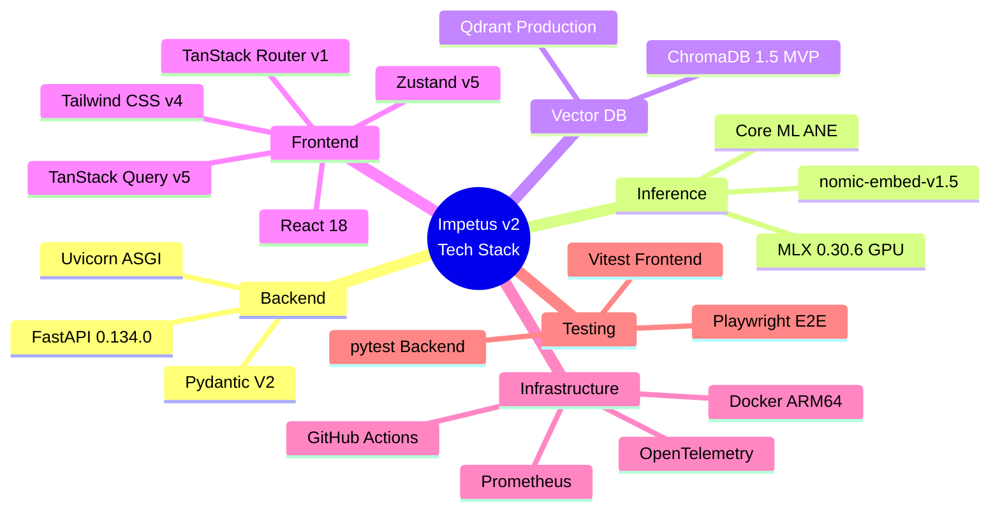

## System Architecture

### System Context

The C4 context diagram shows Impetus-LLM-Server's boundaries and external actors. The server operates as a local inference platform accessed by developers through direct API calls, the React dashboard, or third-party OpenAI-compatible SDKs.

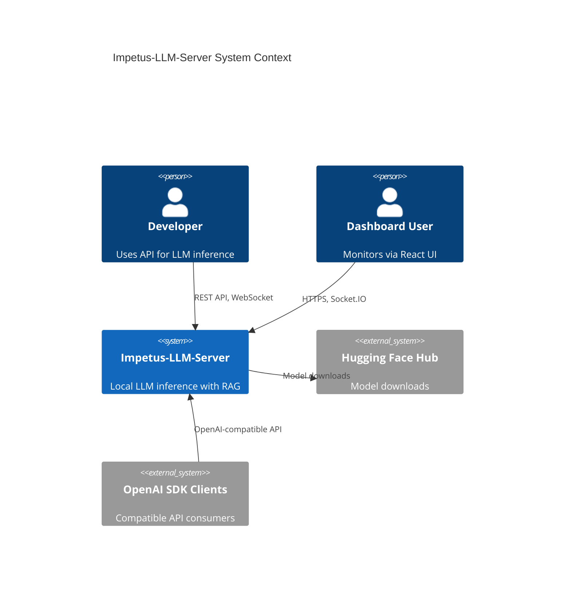

### Component Architecture

The internal component architecture separates concerns across API routing, inference orchestration, RAG pipeline, and real-time communication layers.

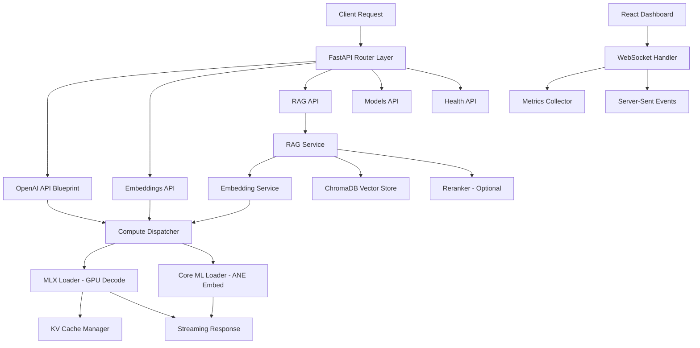

### Data Flow

The data flow diagram traces a RAG-augmented chat completion request from client to response, showing how the retrieval pipeline integrates with the inference engine. The RAG pipeline implements recursive and semantic chunking strategies [29] with hybrid dense-sparse search and cross-encoder reranking for improved retrieval precision [27]. The architecture supports evolution from naive RAG through advanced patterns to agentic RAG with multi-hop retrieval and self-reflection [28].

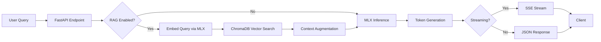

### Hybrid Compute Architecture

The compute dispatcher routes workloads based on hardware capabilities and task characteristics, leveraging unified memory to minimize data movement.

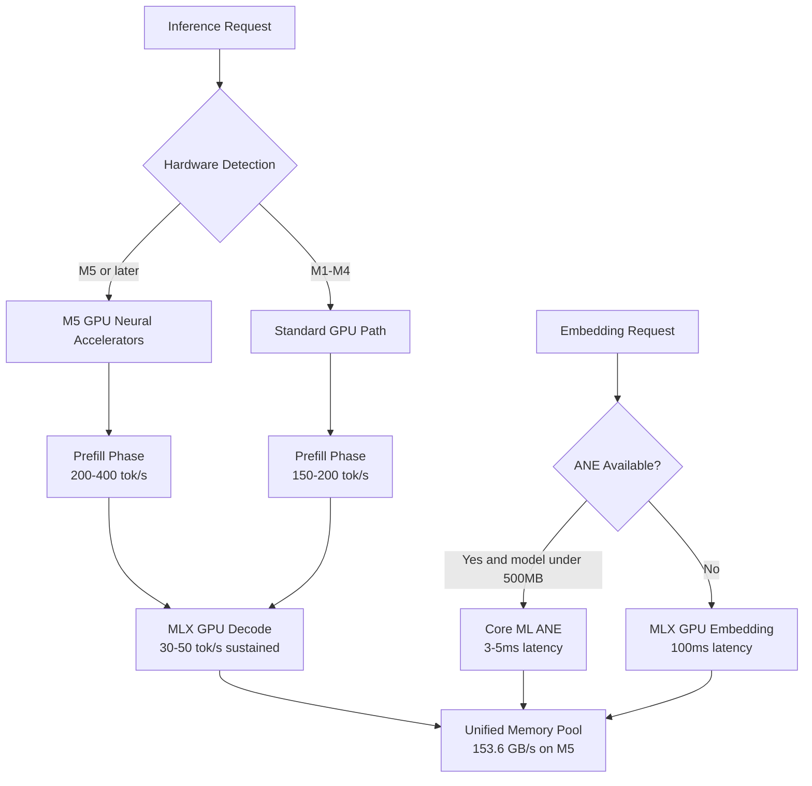

## Database Schema

### Entity-Relationship Diagram

The schema covers vector storage metadata, model configuration, conversation sessions, and system metrics. ChromaDB manages vector data internally; the ER diagram shows application-level entities stored in SQLite.

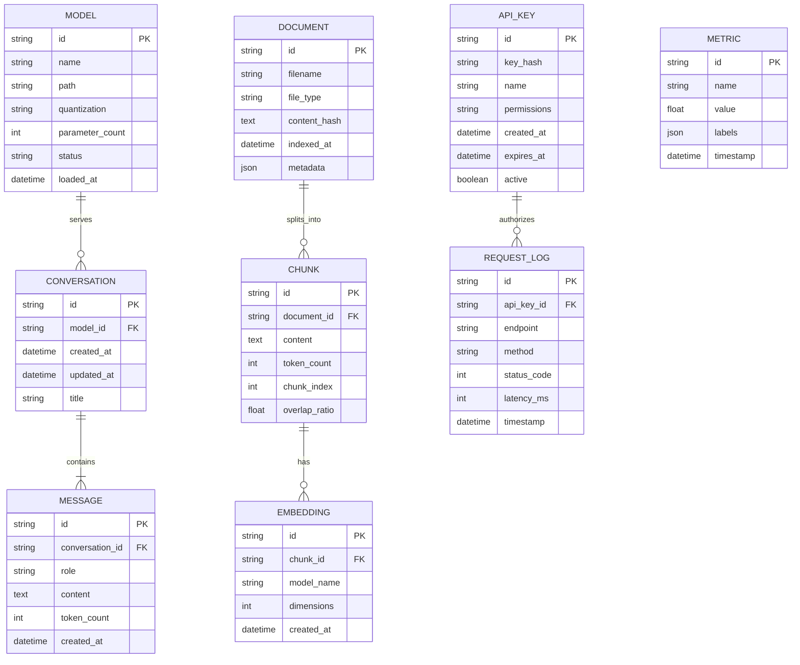

### Entity Definitions

**MODEL** stores loaded and available LLM configurations. The status field tracks lifecycle states: available, loading, loaded, unloading, error.

| Column | Type | Constraints | Description |
|--------|------|-------------|-------------|
| id | VARCHAR(36) | PK, UUID | Unique model identifier |
| name | VARCHAR(255) | NOT NULL | HuggingFace model name |
| path | TEXT | NOT NULL | Local filesystem path |
| quantization | VARCHAR(10) | DEFAULT '4bit' | Quantization level (4bit, 8bit, fp16) |
| parameter_count | BIGINT | | Model parameter count |
| status | VARCHAR(20) | NOT NULL | Lifecycle state |
| loaded_at | TIMESTAMP | | When model was loaded into memory |

**DOCUMENT** tracks ingested files for the RAG pipeline. The content_hash enables deduplication during re-indexing.

**CHUNK** represents split segments of documents with configurable overlap. The chunk_index maintains ordering for reconstruction.

**EMBEDDING** stores vector metadata (actual vectors reside in ChromaDB). The model_name field enables multi-model embedding comparison.

### Indexing Strategy

| Table | Index | Columns | Rationale |
|-------|-------|---------|-----------|
| MESSAGE | idx_msg_conv | conversation_id, created_at | Fast conversation history retrieval |
| CHUNK | idx_chunk_doc | document_id, chunk_index | Ordered chunk retrieval |
| REQUEST_LOG | idx_req_time | timestamp DESC | Recent request analysis |
| REQUEST_LOG | idx_req_key | api_key_id, timestamp | Per-key usage tracking |
| API_KEY | idx_key_hash | key_hash | O(1) authentication lookup |

### Migration Approach

Database migrations use **Alembic** (v1.14+) with SQLAlchemy models as the source of truth. Migrations are version-controlled alongside application code. The migration naming convention follows `YYYYMMDD_HHMMSS_description.py`. ChromaDB manages its own internal schema via the PersistentClient API and requires no external migration tooling.

## API Design

### Endpoint Specifications

All endpoints maintain OpenAI API compatibility where applicable. New endpoints for embeddings, RAG, and model management extend the API surface without breaking existing integrations.

| Method | Path | Auth | Description |
|--------|------|------|-------------|
| POST | /v1/chat/completions | API Key | Generate chat completion (streaming or sync) |
| POST | /v1/embeddings | API Key | Generate text embeddings |
| GET | /v1/models | API Key | List available models |
| POST | /v1/rag/index | API Key | Index documents for RAG |
| GET | /v1/rag/status | API Key | Get RAG index health and stats |
| POST | /v1/rag/search | API Key | Search indexed documents |
| POST | /api/models/load | API Key | Load model into memory |
| POST | /api/models/unload | API Key | Unload model from memory |
| GET | /api/health/live | None | Liveness probe |
| GET | /api/health/ready | None | Readiness probe |
| GET | /api/health/status | None | Detailed system status |
| GET | /api/hardware/info | None | Hardware capabilities |
| GET | /api/metrics | None | Prometheus metrics endpoint |

### Key API Flows

The following sequence diagram shows the RAG-augmented chat completion flow, the primary use case for the modernized server.

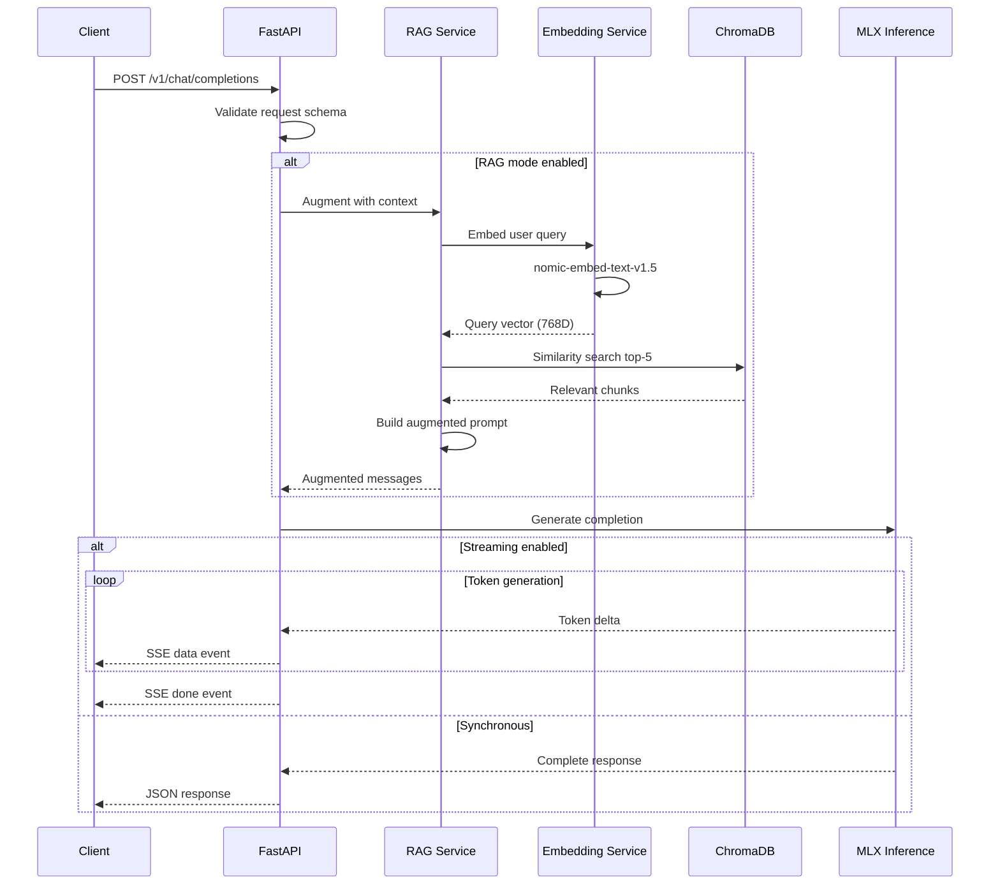

### Request and Response Schemas

**POST /v1/chat/completions**

Request:

```json
{
  "model": "string (required, model identifier)",
  "messages": [
    {
      "role": "system | user | assistant (required)",
      "content": "string (required)"
    }
  ],
  "stream": "boolean (default: false)",
  "temperature": "float (0.0-2.0, default: 0.7)",
  "max_tokens": "integer (default: 2048)",
  "top_p": "float (0.0-1.0, default: 1.0)",
  "rag_mode": "boolean (default: false)",
  "rag_top_k": "integer (default: 5)"
}
```

Response (200, non-streaming):

```json
{
  "id": "chatcmpl-uuid",
  "object": "chat.completion",
  "created": 1709049600,
  "model": "mlx-community/Mistral-7B-Instruct-v0.3-4bit",
  "choices": [
    {
      "index": 0,
      "message": {
        "role": "assistant",
        "content": "string"
      },
      "finish_reason": "stop | length"
    }
  ],
  "usage": {
    "prompt_tokens": 150,
    "completion_tokens": 200,
    "total_tokens": 350
  }
}
```

**POST /v1/embeddings**

Request:

```json
{
  "model": "string (required, embedding model)",
  "input": "string | string[] (required, text to embed)",
  "encoding_format": "float | base64 (default: float)",
  "dimensions": "integer (optional, Matryoshka dim)"
}
```

Response (200):

```json
{
  "object": "list",
  "data": [
    {
      "object": "embedding",
      "index": 0,
      "embedding": [0.0023, -0.0091, 0.0152]
    }
  ],
  "model": "nomic-embed-text-v1.5",
  "usage": {
    "prompt_tokens": 12,
    "total_tokens": 12
  }
}
```

### Error Code Table

| Code | Name | HTTP Status | Description |
|------|------|-------------|-------------|
| MODEL_NOT_FOUND | Model Not Found | 404 | Requested model not available |
| MODEL_NOT_LOADED | Model Not Loaded | 503 | Model exists but not loaded into memory |
| INVALID_REQUEST | Invalid Request | 400 | Request schema validation failed |
| RATE_LIMITED | Rate Limited | 429 | Too many requests, retry after header |
| INFERENCE_ERROR | Inference Error | 500 | MLX inference failed |
| EMBEDDING_ERROR | Embedding Error | 500 | Embedding generation failed |
| RAG_INDEX_ERROR | RAG Index Error | 500 | Document indexing failed |
| AUTH_REQUIRED | Authentication Required | 401 | Missing or invalid API key |
| INSUFFICIENT_MEMORY | Insufficient Memory | 507 | Not enough memory to load model |

### Versioning Strategy

API versioning uses URL path prefixes (/v1/, /v2/) following the OpenAI convention. The /v1/ prefix is the current and only supported version. Breaking changes will introduce /v2/ with a minimum 6-month deprecation window for /v1/. Non-breaking additions (new optional fields, new endpoints) are added to the current version without a version bump.

### Rate Limiting and Pagination

Rate limiting uses the token bucket algorithm implemented via an in-memory store (upgradeable to Redis for multi-instance deployments), following patterns established by Flask-Limiter [40]. Default limits: 60 requests per minute for inference endpoints, 120 requests per minute for read-only endpoints. Rate limit headers follow RFC 6585 conventions: X-RateLimit-Limit, X-RateLimit-Remaining, X-RateLimit-Reset.

Pagination for list endpoints uses cursor-based pagination with limit and after parameters, returning a has_more boolean and next_cursor field.

## Authentication and Authorization

### Auth Provider Recommendation

For a local-first inference server, a lightweight API key system is the recommended authentication mechanism. External auth providers (Auth0, Clerk, Supabase Auth) are evaluated for future multi-user or cloud deployment scenarios.

| Criterion | Local API Keys | Auth0 | Clerk | Supabase Auth |
|-----------|---------------|-------|-------|---------------|
| Pricing | Free | $0.07/MAU | $0.02/MAU | $0.00325/MAU |
| Complexity | Minimal | High | Medium | Medium |
| SSO Support | No | Yes (SAML) | Yes | Limited |
| Local-First | Yes | No (cloud) | No (cloud) | Partial |
| Offline Operation | Yes | No | No | Partial |
| Use Case | Solo developer, local | Enterprise, multi-tenant | SaaS, React apps | PostgreSQL teams |

**Recommendation: Local API key management** for the current local-first architecture, with an abstraction layer that allows plugging in Auth0 or Clerk for future cloud deployment.

### Auth Flow

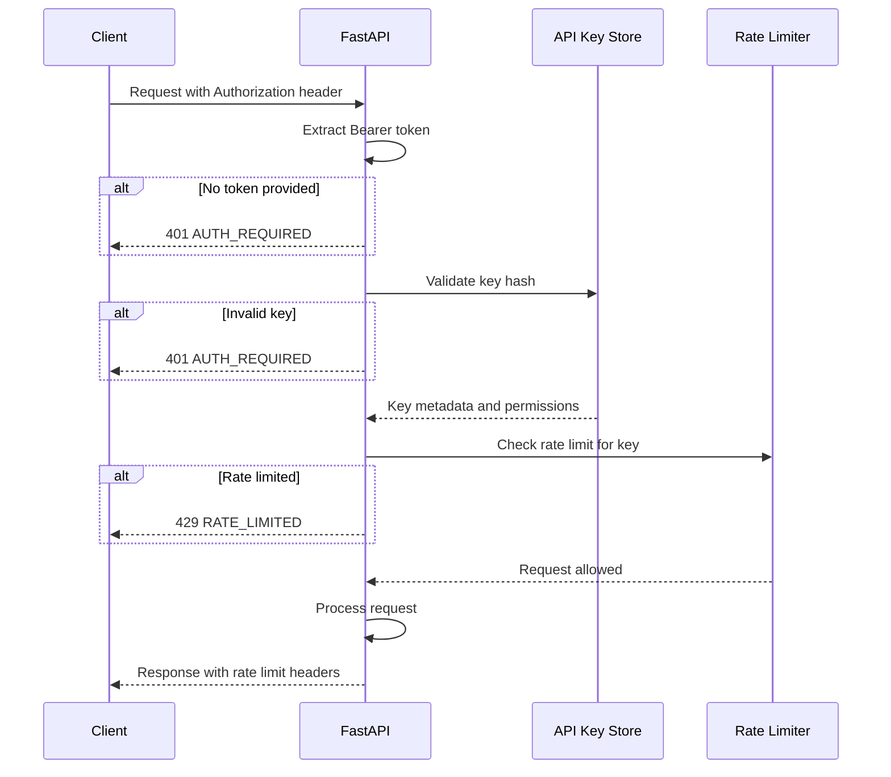

### Role and Permission Model

| Role | Permissions | Description |
|------|-------------|-------------|
| admin | All operations | Full access including model management |
| user | inference, embeddings, rag_search | Standard inference and RAG access |
| readonly | models_list, health, hardware | Read-only monitoring access |

### Token Lifecycle

API keys follow a simple lifecycle model without refresh tokens. Keys are generated with configurable expiration and can be revoked at any time.

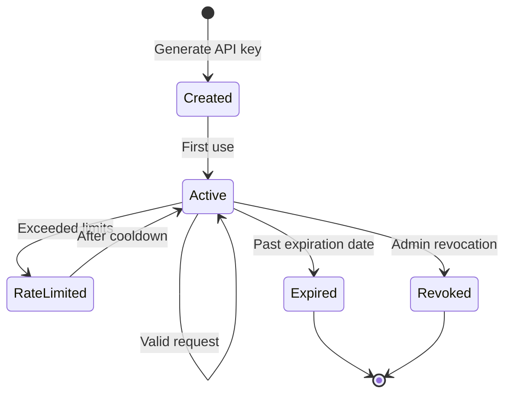

## Infrastructure and Deployment

### Deployment Architecture

Impetus-LLM-Server operates as a local service on macOS with optional containerized deployment for development and testing.

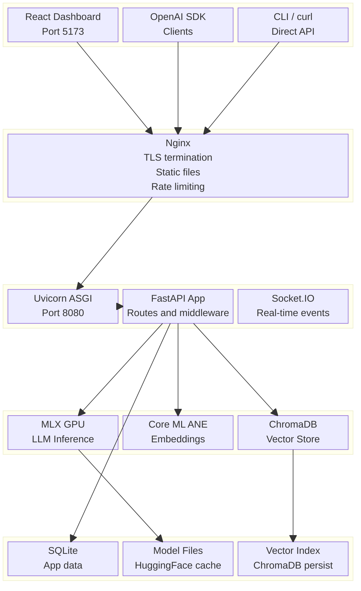

### CI/CD Pipeline

The CI/CD pipeline runs on GitHub Actions with optimized caching for 50-80% workflow time reduction [15]. Docker images use multi-platform builds targeting ARM64 natively for Apple Silicon [38], and blue-green deployment patterns enable zero-downtime local server updates [39].

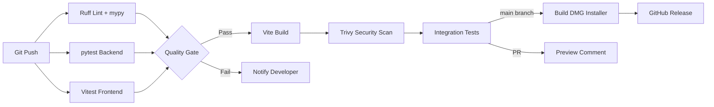

### Environment Strategy

| Environment | Purpose | Configuration |
|-------------|---------|---------------|
| Development | Local development with hot reload | IMPETUS_ENV=development, debug=true |
| Testing | CI/CD automated testing | IMPETUS_ENV=testing, mock models |
| Staging | Pre-release validation on physical hardware | IMPETUS_ENV=staging, real models |
| Production | End-user deployment via DMG or standalone app | IMPETUS_ENV=production, optimized |

### Monitoring and Observability

The observability stack centers on OpenTelemetry for instrumentation with Prometheus for metrics collection, maintaining zero vendor lock-in at zero cost [16].

| Component | Tool | Purpose |
|-----------|------|---------|
| Metrics | Prometheus + OpenTelemetry | Request latency, token throughput, memory usage |
| Traces | OpenTelemetry SDK | End-to-end request tracing across components |
| Logs | Python logging + structured JSON | Application events, errors, debug info |
| Errors | Sentry (optional) [41] | Exception tracking with stack traces |
| Dashboards | Grafana (optional) | Visual metrics exploration |
| Alerts | Prometheus Alertmanager | Threshold-based notifications |

Key metrics to instrument:

- `impetus_inference_duration_seconds` (histogram): Token generation latency
- `impetus_tokens_generated_total` (counter): Total tokens generated
- `impetus_model_memory_bytes` (gauge): Memory consumed by loaded models
- `impetus_rag_search_duration_seconds` (histogram): Vector search latency
- `impetus_embedding_duration_seconds` (histogram): Embedding generation time
- `impetus_active_connections` (gauge): Current WebSocket connections

## Security Considerations

### Threat Model

The primary threat surface for a local inference server is network-adjacent access and dependency supply chain attacks. Remote exploitation is limited by the local deployment model.

| Threat Vector | Risk Level | Applicable |
|---------------|------------|------------|
| Network-adjacent API access | Medium | Yes (local network) |
| Dependency supply chain | Medium | Yes (PyPI, npm) |
| Model poisoning via HuggingFace | Low | Yes (model downloads) |
| Prompt injection | Medium | Yes (user input to LLM) |
| Local privilege escalation | Low | macOS sandboxing |
| Data exfiltration | Low | Local-only data |

### OWASP Top 10 Mitigations

| Vulnerability | Applies | Mitigation Strategy |
|---------------|---------|---------------------|
| A01 Broken Access Control | Yes | API key validation on all inference endpoints, role-based permissions |
| A02 Cryptographic Failures | Yes | bcrypt for API key hashing, TLS via Nginx, no plaintext secrets |
| A03 Injection | Yes | Pydantic V2 input validation, parameterized SQLite queries via SQLAlchemy |
| A04 Insecure Design | Partial | Rate limiting, request size limits, model memory guards |
| A05 Security Misconfiguration | Yes | Security headers via middleware, CORS whitelist, debug mode disabled in production |
| A06 Vulnerable Components | Yes | Trivy scanning in CI/CD, Dependabot for dependency updates [17] |
| A07 Auth Failures | Yes | API key rotation support, key expiration, brute-force rate limiting |
| A08 Software Integrity | Yes | Signed releases, SBOM generation, pip hash verification |
| A09 Logging Failures | Yes | Structured JSON logging, audit trail for API key operations |
| A10 SSRF | Low | No outbound HTTP from inference path, model downloads via allowlist |

### Dependency Scanning

Automated dependency scanning integrates Trivy for container and filesystem scanning (free, fast local execution) with Dependabot for automated pull requests on vulnerable dependencies [18]. Software Bill of Materials (SBOM) generation follows CISA 2025 guidelines using `trivy sbom` output.

## Testing Strategy

### Test Pyramid

The testing strategy follows a layered pyramid prioritizing fast, isolated unit tests with targeted integration and end-to-end coverage.

| Layer | Coverage Target | Tools | Scope |
|-------|----------------|-------|-------|
| Unit Tests | 80%+ | pytest 8.3+, Vitest 4.0 | Individual functions, schema validation, utilities |
| Integration Tests | 60%+ | pytest + httpx, Vitest + MSW | API endpoints, database operations, RAG pipeline |
| E2E Tests | Critical paths | Playwright 1.49+ | Full user flows through dashboard |
| Performance Tests | Key metrics | locust 2.32+, MLX benchmarks | Inference throughput, RAG latency |

### Tool Recommendations

**Backend Testing:**

| Tool | Version | Purpose |
|------|---------|---------|
| pytest | 8.3+ | Test runner, fixtures, parametrize |
| pytest-asyncio | 0.24+ | Async test support for FastAPI |
| httpx | 0.28+ | Async HTTP client for API testing |
| pytest-cov | 5.0+ | Coverage reporting |
| factory-boy | 3.3+ | Test data factories |
| hypothesis | 6.115+ | Property-based testing for schemas |

**Frontend Testing:**

| Tool | Version | Purpose |
|------|---------|---------|
| Vitest | 4.0.18 | Unit and component testing (1.2s boot) [19] |
| React Testing Library | 16.1+ | Component behavior testing |
| Playwright | 1.49+ [44] | End-to-end browser testing |
| MSW | 2.7+ | API mocking for integration tests |
| Istanbul | via Vitest | Coverage reporting |

## Implementation Roadmap

### Gantt Chart

The implementation roadmap spans 24 weeks organized into six phases, designed for a solo developer with parallelizable tasks noted.

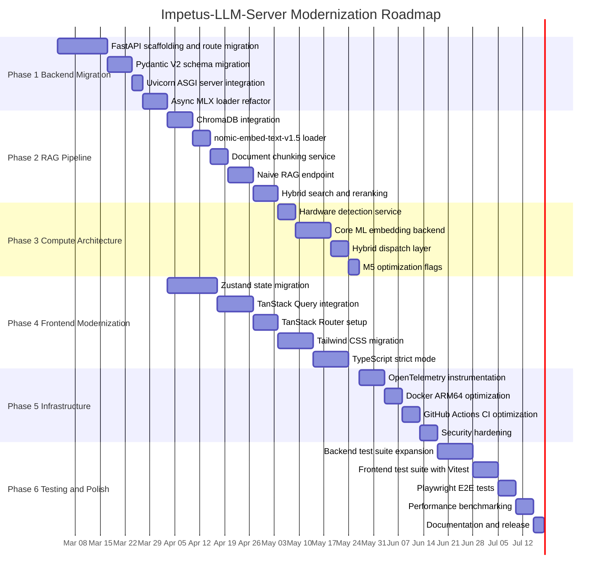

### Sprint and Milestone Breakdown

| Phase | Milestone | Deliverables | Duration |
|-------|-----------|--------------|----------|
| Phase 1 | Backend Migration Complete | FastAPI app with all existing routes ported, async MLX loader, passing existing tests | 4.5 weeks |
| Phase 2 | RAG Pipeline Operational | ChromaDB integration, embedding generation, naive RAG endpoint, hybrid search | 4.5 weeks |
| Phase 3 | Hybrid Compute Active | Core ML ANE embeddings, hardware detection, dispatch routing | 3.5 weeks |
| Phase 4 | Frontend Modernized | Zustand state, TanStack Query and Router, Tailwind styling, TypeScript strict | 7 weeks |
| Phase 5 | Infrastructure Hardened | OpenTelemetry metrics, optimized Docker and CI, security headers | 3 weeks |
| Phase 6 | Release Ready | Test coverage targets met, benchmarks documented, DMG installer updated | 4 weeks |

### Team Allocation

For a solo developer, phases are sequential. With two developers, the following parallelization is recommended:

- **Developer A**: Phases 1, 2, 3 (backend, RAG, compute) - 12.5 weeks
- **Developer B**: Phase 4 (frontend, starting after Phase 1 completes) - 7 weeks, then Phase 5 - 3 weeks

Total with two developers: approximately 14 weeks.

## Cost Estimation

### Monthly Infrastructure Costs

Impetus-LLM-Server is designed as a local-first application, minimizing ongoing infrastructure costs.

| Category | Service | Monthly Cost | Notes |
|----------|---------|-------------|-------|
| Compute | Local Mac (existing hardware) | $0 | Apple Silicon, already owned |
| Database | SQLite (embedded) | $0 | No separate service |
| Vector DB | ChromaDB (embedded) | $0 | Local persistence |
| Monitoring | Prometheus + Grafana (self-hosted) | $0 | Docker containers on local machine |
| Error Tracking | Sentry (free tier) | $0 | 5K errors per month |
| CI/CD | GitHub Actions (free tier) | $0 | 2,000 minutes per month |
| Model Storage | Local disk | $0 | HuggingFace cache |
| TLS Certificate | Let's Encrypt (if exposed) | $0 | Auto-renewal |
| **Total (local)** | | **$0/month** | |

**Optional cloud components (if scaling beyond local):**

| Category | Service | Monthly Cost | Notes |
|----------|---------|-------------|-------|
| Compute | AWS EC2 Mac (mac2.metal) | $645 | 24-hour minimum tenancy |
| Vector DB | Qdrant Cloud (1M vectors) | $65 | Managed service |
| Monitoring | Datadog (1 host) | $15-31 | Infrastructure monitoring |
| Error Tracking | Sentry Team | $26 | 50K events per month |
| **Total (cloud)** | | **$751-$767/month** | |

### Cost Distribution

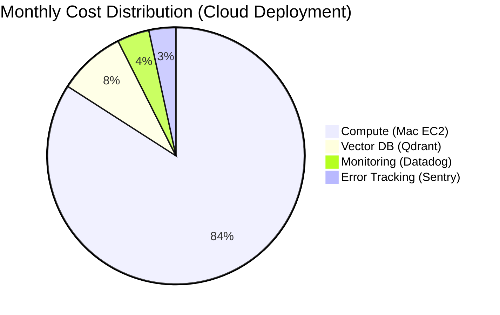

### Development Effort Estimate

| Phase | Effort (person-weeks) | Assumptions |
|-------|----------------------|-------------|
| Phase 1: Backend Migration | 4.5 | Solo developer, familiar with FastAPI |
| Phase 2: RAG Pipeline | 4.5 | ChromaDB documented, MLX embedding tested |
| Phase 3: Compute Architecture | 3.5 | coremltools learning curve included |
| Phase 4: Frontend Modernization | 7.0 | React experience, learning Zustand and TanStack |
| Phase 5: Infrastructure | 3.0 | Docker and CI experience |
| Phase 6: Testing and Polish | 4.0 | Testing infrastructure setup included |
| **Total** | **26.5 person-weeks** | Solo developer, full-time |

## Risk Assessment

### Risk Matrix

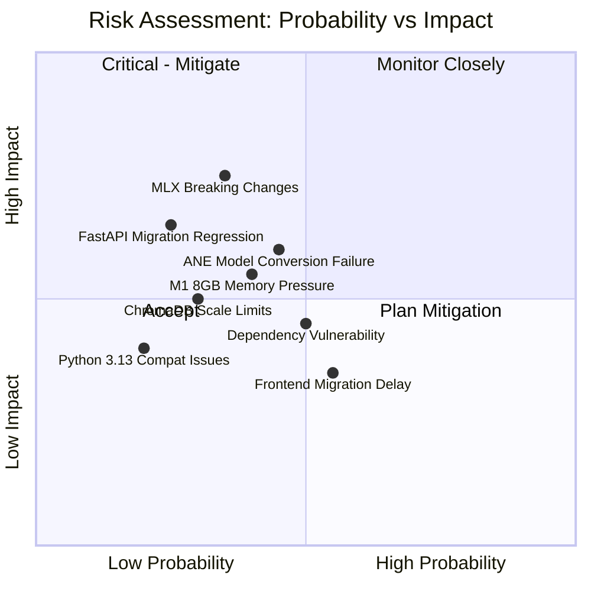

### Risk Table

| Risk | Probability | Impact | Mitigation |
|------|-------------|--------|------------|
| MLX breaking changes in minor versions | Medium | High | Pin MLX version, test upgrades in staging, maintain compatibility shim |
| Core ML ANE model conversion fails for custom models | Medium | Medium | Test on reference models first, fallback to GPU-only embedding path |
| ChromaDB reaches scale limits at 50M vectors | Low | Medium | Abstract vector DB interface, migration guide to Qdrant prepared |
| FastAPI migration introduces API regressions | Low | High | Comprehensive integration test suite before and after migration |
| Frontend migration exceeds timeline estimate | Medium | Low | Phase incrementally, each phase delivers standalone value |
| Critical dependency vulnerability discovered | Medium | Medium | Trivy CI scanning, Dependabot auto-PRs, 48-hour patch policy |
| M1 8GB memory pressure with model plus RAG | Medium | Medium | Memory budget tracking, configurable embedding dimensions via Matryoshka |
| Python 3.13 compatibility issues with dependencies | Low | Medium | Test matrix includes 3.11 and 3.12 as fallback targets |

### Vendor Lock-in Analysis

| Technology | Lock-in Risk | Migration Difficulty | Mitigation |
|-----------|-------------|---------------------|------------|
| FastAPI | Low | Medium (ASGI standard) | Standard ASGI app, portable to any ASGI server |
| MLX | Medium | High (Apple-only) | MLX is Apple Silicon exclusive by design; acceptable for target platform |
| ChromaDB | Low | Low (standard embedding API) | Abstract via VectorStore interface, Qdrant as drop-in alternative |
| React | Low | Medium (JSX ecosystem) | Dominant framework, 5+ year viability guaranteed [20] |
| Tailwind CSS | Low | Low (utility classes) | Standard CSS output, removable without code changes |
| GitHub Actions | Low | Low (YAML workflows) | Standard CI/CD patterns, portable to GitLab CI or CircleCI |
| OpenTelemetry | Very Low | N/A (open standard) | CNCF standard with 100+ vendor backends [21] |

## Methodology

This Software Architecture Blueprint was produced through systematic multi-source research conducted on February 27, 2026.

### Research Process

Six parallel research sub-agents conducted independent investigations across the following facets:

1. **Python Framework and Async Ecosystem** - Evaluated FastAPI, Litestar, Flask 3/Quart, and Starlette across 15 criteria including version currency, streaming quality, job market demand, and MLX integration feasibility.

2. **Vector Database and RAG Architecture** - Assessed ChromaDB, Qdrant, LanceDB, SQLite-vec, and Milvus Lite for local-first Apple Silicon deployment. Evaluated three embedding models and three RAG pattern levels.

3. **NPU/GPU/CPU Compute Architecture** - Investigated Apple Neural Engine capabilities, MLX ANE support status, coremltools maturity, hybrid compute strategies, and M5 GPU neural accelerators.

4. **Frontend Modernization** - Compared state management (Zustand, Jotai, TanStack Store, Nanostores), data fetching (TanStack Query, SWR), routing (TanStack Router, React Router v7), and styling (Tailwind, CSS Modules, Vanilla Extract).

5. **Infrastructure and DevOps** - Evaluated Docker optimization for Apple Silicon, monitoring stacks, CI/CD improvements, deployment patterns, and OWASP security mitigations.

6. **Community Health and Long-term Viability** - Analyzed Stack Overflow activity, Discord community sizes, corporate backing, job market demand, and LTS schedules for 22+ technologies.

### Tools Used

| Tool | Usage |
|------|-------|
| Firecrawl CLI v1.7.1 | Web search, documentation scraping, GitHub statistics |
| WebSearch and WebFetch | Supplementary web research |
| Context7 | Framework documentation lookup (FastAPI, React, Vite) |
| Hugging Face MCP | ML paper search, embedding model cards |
| GitHub repositories | Stars, issues, releases, community metrics |
| PyPI statistics | Download counts, version history |
| npm trends | Frontend package adoption data |

### Scope and Limitations

- Research reflects technology state as of February 27, 2026
- Benchmark data sourced from published results, not independently verified
- Cost estimates assume US pricing and may vary by region
- M5 GPU neural accelerator benchmarks from Apple research publications
- Community metrics (Discord members, job postings) are point-in-time snapshots

## Sources and References

[1] FastAPI. (2026). FastAPI GitHub Repository. https://github.com/fastapi/fastapi (95.7k stars, accessed February 27, 2026)

[2] Better Stack Community. (2025). Litestar vs FastAPI: A Complete Comparison. https://betterstack.com/community/guides/scaling-python/litestar-vs-fastapi/

[3] FastAPI. (2026). FastAPI Release Notes. https://fastapi.tiangolo.com/release-notes/ (v0.134.0, February 27, 2026)

[4] Barrios, W., et al. (2025). Production-Grade Local LLM Inference on Apple Silicon. *arXiv*. https://arxiv.org/pdf/2511.05502

[5] Apple Machine Learning Research. (2025). On Device Llama 3.1 with Core ML. https://machinelearning.apple.com/research/core-ml-on-device-llama

[6] Apple Machine Learning Research. (2025). Exploring LLMs with MLX and the Neural Accelerators in the M5 GPU. https://machinelearning.apple.com/research/exploring-llms-mlx-m5

[7] Chroma. (2026). ChromaDB GitHub Releases. https://github.com/chroma-core/chroma/releases (v1.5.1, February 19, 2026)

[8] Firecrawl. (2026). Best Vector Databases in 2026: A Complete Comparison Guide. https://www.firecrawl.dev/blog/best-vector-databases

[9] Qdrant. (2026). Vector Database Benchmarks. https://qdrant.tech/benchmarks/

[10] Nomic AI. (2025). nomic-embed-text-v1.5 Model Card. *Hugging Face*. https://huggingface.co/nomic-ai/nomic-embed-text-v1.5

[11] npm trends. (2026). Zustand vs Jotai vs Recoil. https://npmtrends.com/jotai-vs-nanostores-vs-recoil-vs-zustand

[12] TanStack. (2026). TanStack Query Documentation. https://tanstack.com/query/latest/docs/framework/react/comparison

[13] Medium. (2026, January). TanStack Router vs React Router v7. https://medium.com/ekino-france/tanstack-router-vs-react-router-v7-32dddc4fcd58

[14] Tailwind CSS. (2025). Tailwind CSS v4.0 Release. https://tailwindcss.com/blog/tailwindcss-v4

[15] OneUptime. (2026, February 2). GitHub Actions Performance Optimization. https://oneuptime.com/blog/post/2026-02-02-github-actions-performance-optimization/view

[16] Last9. (2026). OpenTelemetry vs Datadog. https://last9.io/blog/opentelemetry-vs-datadog/

[17] Aikido Security. (2026). Snyk vs Trivy Comparison. https://www.aikido.dev/blog/snyk-vs-trivy

[18] SoftwareSeni. (2026). Supply Chain Security Tool Selection Framework. https://www.softwareseni.com/supply-chain-security-tool-selection-framework-comparing-snyk-dependabot-and-open-source-alternatives/

[19] Vitest. (2026). Vitest Documentation. https://vitest.dev/ (v4.0.18)

[20] React Foundation. (2026, February 24). Announcing the React Foundation. Linux Foundation. https://reactfoundation.org/

[21] OpenTelemetry. (2026). OpenTelemetry Documentation. https://opentelemetry.io/ (CNCF graduated project)

[22] Apple Newsroom. (2025, October). Apple unleashes M5. https://www.apple.com/newsroom/2025/10/apple-unleashes-m5-the-next-big-leap-in-ai-performance-for-apple-silicon/

[23] Apple Machine Learning Research. (2023). Deploying Transformers on the Apple Neural Engine. https://machinelearning.apple.com/research/neural-engine-transformers

[24] Hollance. (2024). neural-engine: Everything we actually know about the Apple Neural Engine. *GitHub*. https://github.com/hollance/neural-engine

[25] ml-explore. (2023). MLX Issue 18: ANE support. *GitHub*. https://github.com/ml-explore/mlx/issues/18

[26] IntFloat. (2024). Improving Text Embeddings with Large Language Models. *arXiv*. https://arxiv.org/pdf/2401.00368

[27] Superlinked. (2025). Optimizing RAG with Hybrid Search and Reranking. https://superlinked.com/vectorhub/articles/optimizing-rag-with-hybrid-search-reranking

[28] Agentic RAG Survey. (2025). *arXiv*. https://arxiv.org/html/2501.09136v3

[29] Dataquest. (2025). Document Chunking Strategies for Vector Databases. https://www.dataquest.io/blog/document-chunking-strategies-for-vector-databases/

[30] Litestar. (2026). Litestar Documentation. https://litestar.dev/ (v2.21.0)

[31] Quart. (2024). Flask Migration Guide. https://quart.palletsprojects.com/en/latest/how_to_guides/flask_migration/

[32] PyPI. (2026). FastAPI Package Statistics. https://pypi.org/project/fastapi/

[33] PyPI. (2026). Starlette Package Statistics. https://pypi.org/project/starlette/

[34] Barrios, W., et al. (2025). Benchmarking On-Device ML on Apple Silicon with MLX. *arXiv*. https://arxiv.org/html/2510.18921v1

[35] LanceDB. (2025). Scaling LanceDB: Running 700 million vectors in production. https://sprytnyk.dev/posts/running-lancedb-in-production/

[36] coremltools. (2025). coremltools v9.0. *PyPI*. https://pypi.org/project/coremltools/

[37] Apple Developer. (2025). Apple Intelligence. https://developer.apple.com/apple-intelligence/

[38] Docker. (2026). Multi-platform builds. https://docs.docker.com/build/building/multi-platform/

[39] Harness. (2026). Blue-Green and Canary Deployment Strategies. https://www.harness.io/blog/blue-green-canary-deployment-strategies

[40] Flask-Limiter. (2026). Rate Limiting Extension for Flask. https://flask-limiter.readthedocs.io/

[41] Sentry. (2026). Flask Error Monitoring. https://sentry.io/for/flask/

[42] pmndrs. (2026). Zustand GitHub Repository. https://github.com/pmndrs/zustand (57.1k stars)

[43] React Three Fiber. (2026). Documentation. https://r3f.docs.pmnd.rs/ (v9.5.0)

[44] Playwright. (2026). Documentation. https://playwright.dev/ (v1.49+)

[45] MLX. (2026). MLX Documentation v0.30.6. https://ml-explore.github.io/mlx/build/html/index.html

[46] Apple. (2025). Quantization Overview for Core ML Tools. https://apple.github.io/coremltools/docs-guides/source/opt-quantization-overview.html

[47] Qdrant. (2026). Qdrant GitHub Repository. https://github.com/qdrant/qdrant (29.1k stars)

[48] TechRadar. (2025). M5 Pro vs M5 Max Memory Bandwidth. https://www.techradar.com/pro/the-true-pro-tax-m5-pro-vs-m5-max-why-that-extra-275gb-s-of-memory-bandwidth-is-worth-thousands-of-dollars-for-video-and-ai-workflows/
